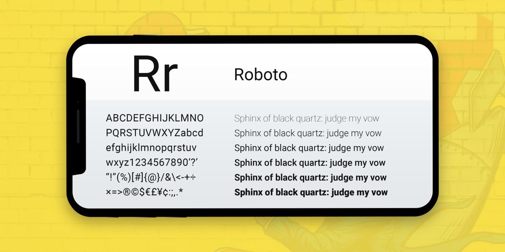
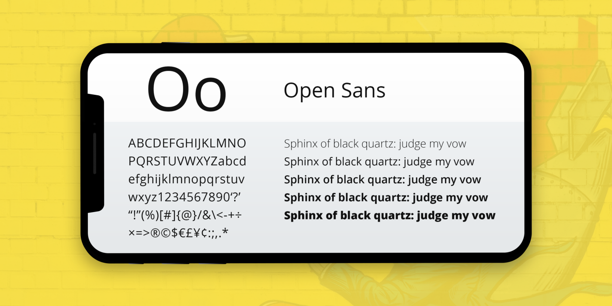
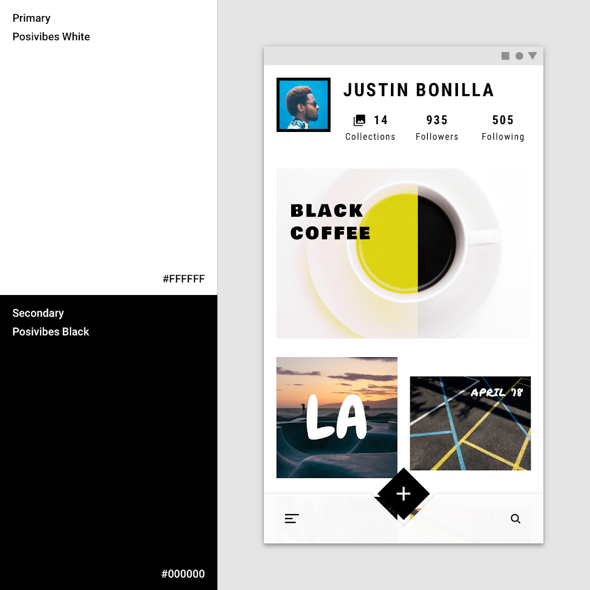
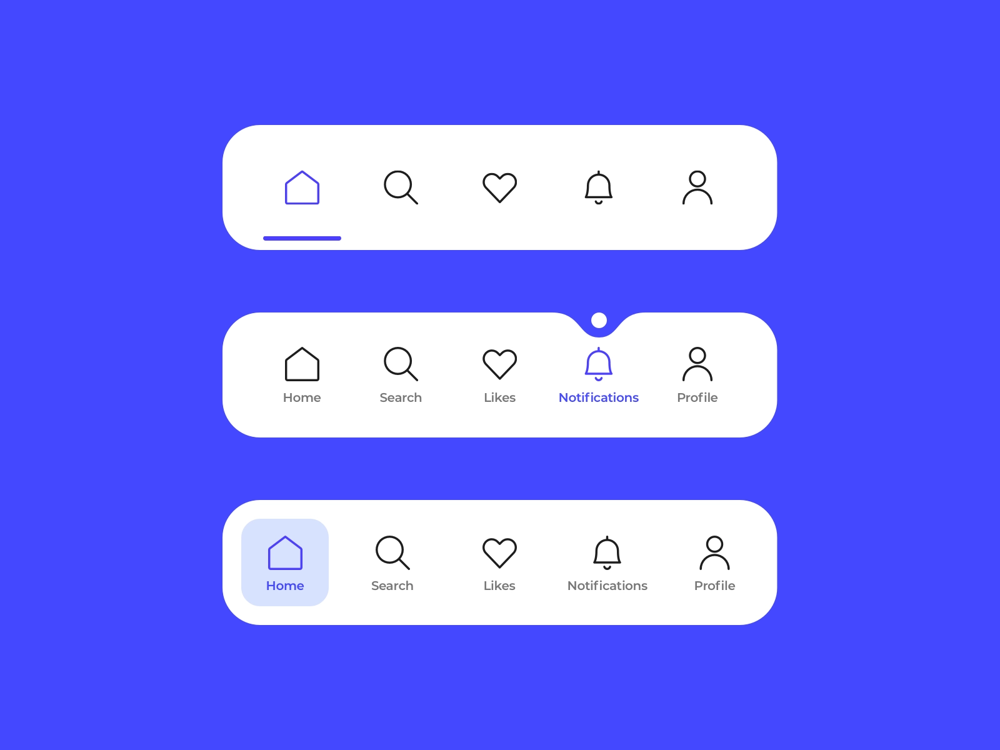

# DIU - Practica 3, entregables

## Análisis de MuseMap
En general nos ha parecido una idea muy buena con un desarrollo muy bien llevado.

Primero hicieron una lluvia de ideas asumiendo que necesitan los usuarios e hicieron una lista.
Seguidamente decidieron hacer trabajo de campo y salieron a las calles de Londres a preguntar y fijarse en cómo interactúan los ciudadanos con el arte local. De esta forma sacaron más aspectos en claro como que la gente si quería buscar más información sobre una pieza de arte acudían a Google lo primero.
Una vez terminado el trabajo de campo hicieron una matriz de tareas comparando otras apps y resaltando funciones que no se han explorado mucho en estas para implementar en MuseMap.
Esto fue seguido de otra lluvia de ideas para hacer un mapa de empatía resaltando puntos críticos para los usuarios.
Después se hicieron una serie de entrevistas a usuarios para que dieran su opinión sobre la aplicación con lo que crearon un mapa de afinidad con la información recogida, de esta forma descubrieron que algunas cosas asumidas al principio eran falsas, y partieron de este mapa para el desarrollo.
También crearon dos personas ficticias con sus metas motivaciones, etc. y sacaron sus mapas de experiencia en distintas situaciones, de esta forma descubrieron, entre otras cosas,  que la gente no suele interesarse por el arte de la ciudad en la que vive al estar acostumbrado a él.
Ya en fase de desarrollo del prototipo hicieron varios bocetos de la aplicación con creciente calidad y decidieron centrarse en la parte del mapa y lo social.
Una vez terminado el prototipo se reunieron para pensar en el futuro de la aplicación y mejoras que podrían implementarse.

Personalmente creemos que las propuestas de hacer un trabajo de campo, comparar otras apps y las entrevistas a la gente fueron los métodos más interesantes de diseño.

En cuanto a otro método que hubiésemos usado pensamos que llamar a un experto y que haga un análisis de la aplicación dando su opinión es muy buena idea.

## Propuesta de elementos de diseño o patrones a usar 

Como tipografía principal de la aplicación hemos decidido optar por una tipografía moderna, sencilla y que sea perfectamente legible: Roboto. Roboto es una fuente de uso libre de Google Fonts. Esta tipografía la podemos combinar con otra tipografía como por ejemplo Open Sans, la cual es también muy utilizada, de uso libre y desarrollada por Google Fonts. Por tanto como tipografía principal empleamos Roboto y como tipografía secundaria Open Sans. Respecto al tamaño de fuente hemos decidido seguir los estándares, para Roboto se recomienda usar un tamaño de 14-18px para el contenido principal mientras que para las cabeceras un tamaño de 28-34px. Respecto a Open Sans también seguimos los estándares, es decir, utilizar un tamaño de 12-16px para contenidos principales y un tamaño de 24-30px para cabeceras.
A continuación adjunto un par de imágenes de cada tipo de fuente:

Roboto:

Open Sans:

-Fuente de las imágenes: https://medium.muz.li/top-5-ui-fonts-for-website-mobile-apps-d78829e58f7e

Respecto a los colores que vamos a utilizar en nuestra página hemos optado por unos colores básicos para no generar confusión a los usuarios cuando usan nuestra aplicación y no se encuentren colores llamativos o incluso colores que molesten a la vista, un ejemplo perfecto de colores que queremos emplear:

Color de letra: Negro
Color de Títulos: Negro
Color de cabeceras y Barra de navegación inferior: Negra
Títulos en las cabeceras o en las barras de navegación: Blanca

Nuestro objetivo es jugar con el blanco y el negro, proporcionando así una aplicación que emplea colores básicos y que pretende dar gran importancia a su contenido. Por tanto, el objetivo principal y por el cual usamos estos colores básicos es conseguir que el usuario se vea más impresionado por el contenido de nuestra aplicación como imágenes de lugares a los que viajar, imágenes compartidas por usuarios, etc. Un ejemplo para ilustrar el camino por el que queremos orientar nuestra aplicación:

-Fuente de la imagen: 
https://material.io/design/color/applying-color-to-ui.html#typography-and-iconography 

Respecto a los patrones:

En primer lugar, como patrón de organización de la información hemos decido implementar el patrón combinado: Destacado/Buscar/Navegar porque combina varios estilos para organizar la información y nos viene perfecto porque además de mostrar información al usuario queremos añadir buscadores para mejorar la experiencia del usuario. Además, cuando un usuario se encuentre navegando puede realizar una búsqueda de forma sencilla sin tener que cambiar de localización dentro de la app.

Cuando se realice un usuario quiera realizar una búsqueda vamos a introducir técnicas de autocompletado y cuando se obtengan los resultados también introduciremos la opción de filtrar los resultados.

En relación a la organización de las imágenes queremos organizar las imágenes en forma de carrusel, creemos que es la forma más utilizada en la actualidad y al usuario le resultará familiar, sabrá utilizar el carrusel. No buscamos proporcionar dificultades ni problemas al usuario durante el uso de nuestra app, luego el uso de estilos/iconos/herramientas ya implementadas por muchas aplicaciones hoy en día nos ayuda a conseguir este objetivo pues el usuario ya está familiarizado a ello. Por último, aclarar que cada una de las imágenes tendrán disponibles las opciones de ampliar la imagen, volver a la anterior imagen, e ir a la siguiente imagen. 

Para el patrón de navegación hemos de decidido implementar la navegación con tabuladores en la parte inferior de nuestra App. La navegación con tabuladores en las aplicaciones móviles ha ido adquiriendo gran importancia y es bastante utilizada pues proporciona una navegación fluida entre las diferentes secciones de nuestra App. Además, es bastante intuitiva pues cuenta con iconos y una pequeña descripción que ayudan al usuario a entender cada una de las secciones disponibles, adjunto un pequeño ejemplo de navegación con tabuladores en Apps:

Fuente de la imagen: 
https://dribbble.com/shots/7057842-Tab-bar-menu-navigation

## Historia en Video del UX Case Study

## Documentación. Valoración del equipo sobre la realización de esta práctica o los problemas surgidos

En general no hemos tenido ningún problema a la hora de realizar esta práctica.
El artículo de MuseMap era claro y conciso, aun estando en inglés nos resultó sencillo el análisis de la aplicación.
 Respecto a los prototipos, colores y tipografía hemos optado por una opción estándar y moderna que hoy en dia es lo más utilizado y tiene más éxito.
