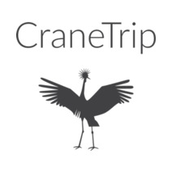
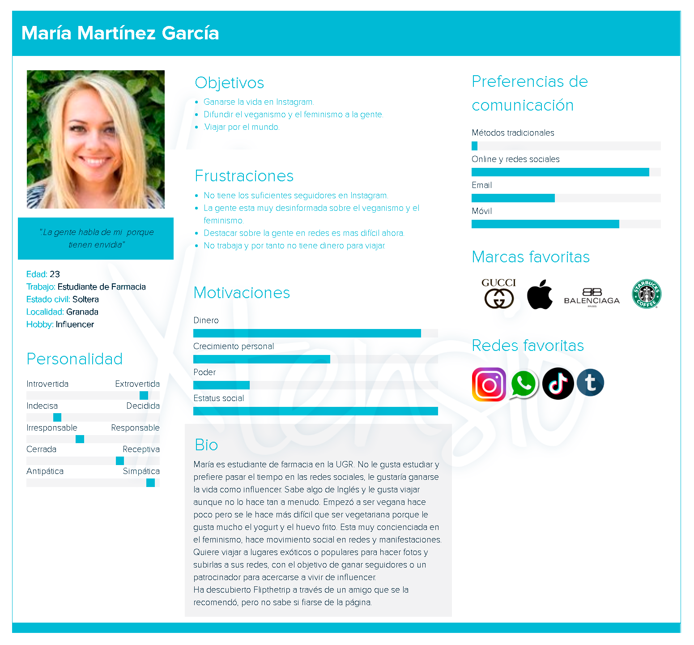
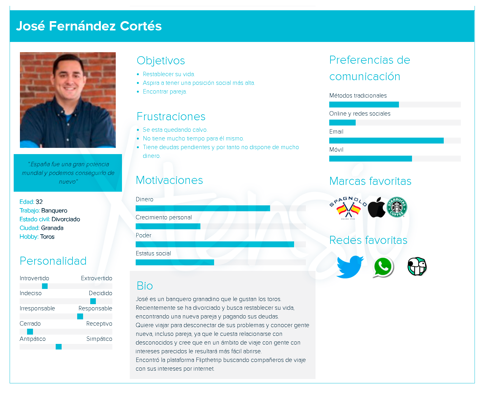
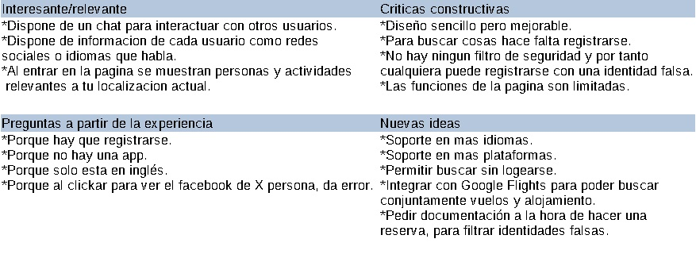
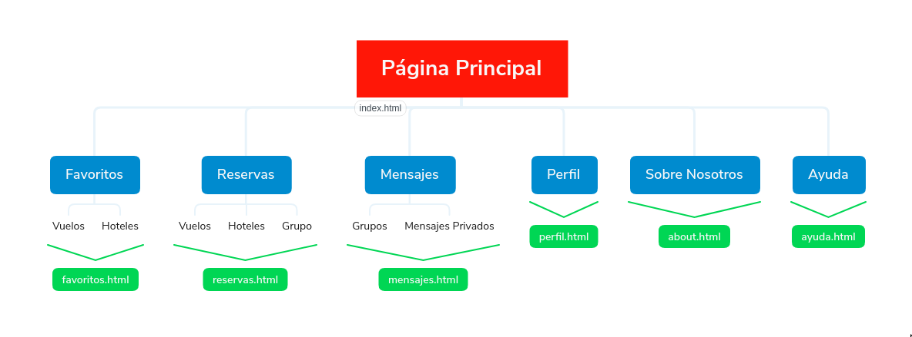
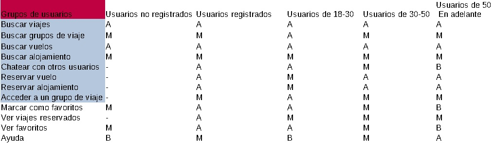

# DIU20
Prácticas Diseño Interfaces de Usuario 2019-20 (Economía Colaborativa) 

Grupo: DIU1_LEJIA.  Curso: 2019/20 

Proyecto: CraneTrip.

Descripción: Aplicación para compartir viaje.

Logotipo: 

Miembros
 * :bust_in_silhouette:   Luis Escobar Reche     :octocat:     
 * :bust_in_silhouette:  Jose Armando Albarado Mamani     :octocat:

----- 

En esta práctica estudiaremos un caso de plataforma de economía colaborativa y realizaremos una propuesta para su diseño Web/movil. Utilizaremos herramientas y entregables descritos en el siguiente CheckList (https://github.com/mgea/UX-DIU-Checklist) 

Qué es economia colaborativa: Martínez-Polo, J. (2019). **El fenómeno del consumo colaborativo: del intercambio de bienes y servicios a la economía de las plataformas**, *Sphera Publica, 1*(19), 24-46. http://sphera.ucam.edu/index.php/sphera-01/article/view/363/14141434

>>> Este documento es el esqueleto del report final de la práctica. Aparte de subir cada entrega a PRADO, se debe actualizar y dar formato de informe final a este documento online. 

# Proceso de Diseño 

## Paso 1. UX Desk Research & Analisis 

 1.a Competitive Analysis
-----
En el ámbito de la economía colaborativa existen muchas páginas que ofrecen este servicio, algunas
muy bien hechas y otras no tanto. Flip the Trip es un página web que nos permite compartir viajes y
obtener información sobre lugares, el motivo por el cual lo hemos elegido es por que carece de
muchas funcionalidades que consideramos que son cruciales para una aplicación de este tipo, como
por ejemplo estar disponibles para varias plataformas, en varios idiomas y que sobre todo tenga un
diseño intuitivo y sencillo, para que pueda atraer a clientes. Al igual que existen páginas que
carecen de funcionalidades importantes como Flip The Trip existen otras muchas que sí cumplen
con estos requisitos y como consecuencia son aplicaciones populares, como por ejemplo
coachsurfing.com, estas páginas tienen un buen diseño y ofrecen una buena experiencia a los
clientes, pero claro si deseamos estudiar las carencias de una aplicación de este tipo lo peor que
podemos hacer es elegir una aplicación cuyas carencias sean mínimas.

 1.b Persona
-----
Como personas ficticias hemos creado a María Martínez García y a José Fernández Cortés. Hemos
elegidos a estas dos personas para poder estudiar dos casos que pueden cubrir un amplio rango en la
sociedad. Por un lado el de una chica que es estudiante a la que le encantan las redes sociales y
dispone de pocos recursos económicos, esta representación de persona se puede reflejar en muchos
jóvenes de hoy en día y nos puede dar un amplio rango de estudio, sobre la mayoría de jóvenes.
Por el otro lado tenemos a una persona de mediana edad cuya prioridad es el trabajo, está pasando
por una separación de su pareja, decide por ello realizar una viaje para conocer a nuevas personas y
poder así despejar su mente y poder vivir una bonita expericienta. Hoy en día suelen pasar estas
situaciones, las personas se ven sobrecargadas ya sea por situaciones de trabajo o por situaciones
sentimentales, por ello decidimos crear a José para poder abarcar también un gran rango en la
sociedad.

-----

 1.c User Journey Map
----
Pensamos que estas experiencias para las dos personas serian las más habituales y consideramos que son las mas adecuadas para probar.

María es una amante de las redes sociales, por ello decide realizar una viaje a Manila (Filipinas)
como su situación económica es baja decide realizar el viaje en compañía. Sus amigos le
recomiendan la página Flip The Trip, ellos le cuentan las buenas experiencias que han tenido al usar
la página, a ella le cuesta adaptarse a la página ya que apenas domina el ingles, pero con ayuda de
amigos que si dominan el inglés consigue encontrar a un sevillano fotógrafo, con el que decide
realizar el viaje después de conocerlo.

José decide emprender un viaje a Nápoles por una temporada con el objetivo de despejar su mente,
cambiar de aires y conocer personas nuevas. Encuentra la página en internet y como domina el
inglés no le resulta difícil encontrar personas que viajen a Nápoles, en esa búsqueda encuentra a
Ann, una mujer residente en Nápoles, establece comunicación con ella a través de la página durante
un tiempo y decide ir allí para poder pasar tiempo con ella.

>>> Comenta brevemente porqué has escogido estas dos experiencias de usuario (y si consideras que son habituales) (80-150 caracteres) 

 1.d Usability Review
---- 
 - Enlace al documento: 
[Revisión de usabilidad](P1/Usability-review.pdf)
 - Valoración final:
45/100
 - Comentario sobre la valoración:  
Después de valorar cada apartado de la plantilla y tras comentar los peores apartados de la
aplicación, la puntuación final es de 45/100, lo cual hace un suspenso. La justificación de esta nota
es que en general esta aplicación es muy incompleta, ofrece pocas funciones, nada de ayuda online,
obliga al usuario a registrarse y no ofrece ninguna clase de medida de seguridad. En cuanto a
rendimiento y diseño visual no esta tan mal, ofrece las características mas básicas de las habituales
en una aplicación web pero en comparación con otras aplicaciones parecidas como Airbnb o
CoachSurfing, se queda obsoleta y muy poco confiable.

## Paso 2. UX Design  

 2.a Feedback Capture Grid
----
Nuestra propuesta de aplicación para compartir viaje se llama CraneTrip.
Consiste en una app para el móvil a corto plazo aunque se planea ampliar a otras plataformas a largo plazo.
Sus principales funciones y lo que la diferencia del resto es que hace la experiencia de las páginas para compartir viaje más fácil. Esto se consigue ya que consiste en un buscador como el de un buscador de vuelos u hoteles, en el que introduces unas fechas y un origen y destino. La búsqueda devuelve tres opciones; vuelos, hoteles o grupos de viaje. La parte de vuelos y hoteles es como cualquier comparador de vuelos, en el que reservas directamente tu vuelo comparándolo para buscar el que más te convenga. El añadido es los grupos, que actúan como grupos de cualquier red social, en el que alguien crea un grupo y los que buscan grupos de viaje solicitan acceso a él, tras tener acceso pueden ver los perfiles de los integrantes y elegir entrar definitivamente o no. Además hay un sistema de puntuación para dar valoraciones negativas o positivas a los compañeros de viaje. También se pueden marcar como favoritos vuelos hoteles o grupos para compararlos más tarde, además las tres cosas actúan como un paquete a la hora de reservar, de tal forma que en el apartado de reservas tengas tu viaje y te indique el vuelo hotel y grupo que has elegido.

 2.b Tasks & Sitemap 
-----
En el sitemap hemos añadido:
Index.html: Será la página principal.
Favoritos.html: Contendrá los viajes, alojamientos o grupos que desee guardar el usuario.
Reservas.html: Contendrá las reservas que tiene confirmado el usuario, tanto vuelos como alojamientos, cada uno de ellos contendrá toda la información asociada a la reserva.
Mensajes: En esta página el usuario podrá compartir mensajes con otro viajante o otro grupo de viajantes.
Perfil.html: En esta página se almacenará toda la información asociada al usuario.
About.html: En esta página se almacenará toda la información acerca de la empresa y que sea de interés para los usuarios.
Ayuda.html: En esta página se almacenará información como preguntas frecuentes, etc. Cualquier tipo de ayuda para el usuario, además se le proporcionará información para que pueda contactar con el equipo de ayuda.

Es esta tabla se ve que tareas se ejecutan con más frecuencia para distintos grupos de usuarios, en gris se marcan las tareas más importantes.
Consideramos estas tareas más importantes basándonos en que si estas funciones fallaran, la aplicación sería un fracaso, en cambio si fallan las otras seguiría siendo un gran fallo pero no un fallo crítico.
Se puede observar que las tareas de grupos, chat, redes sociales y el buscador las usan más los jóvenes y en cambio las tareas de reservar las usan más la gente mayor.

 2.c Labelling 
----
Hemos utilizado iconos que son muy utilizados hoy en dia en cualquier tipo de aplicación y creemos que no confundirán al usuario. En el caso de la página principal un ícono de una casa, en la sección favoritos un corazón, en la reservar un ícono de un libro, en los mensajes una viñera simulando un comentario, en el perfil un ícono de una persona, en about un icono de i, como de información y ya por ultimo de ayuda un icono de una interrogación.

[Labelling](P2/Labelling.pdf)

 2.d Wireframes
-----
Para el desarrollo de bocetos nos hemos centrado en dispositivos móviles, el boceto consta de varias partes:
Pantalla principal: En ella se detallan las búsquedas que desee realizar el usuario concretando el número de viajeros, la fecha, el origen y el destino. Además podrá ver los destinos populares, las fotos publicadas por los usuarios en sus redes sociales y las redes disponibles de la aplicación. Por último también dispondrá de un botón para acceder a los ajustes, y en la parte inferior un pequeño menú para acceder a las distintas secciones de nuestra aplicación.
Ajustes: En esta sección el usuario podrá configurar la aplicación, como activar/desactivar el modo oscuro, activar/desactivar las notificaciones, cerrar sesión, etc.
Búsquedas: Esta sección será la resultante de realizar una búsqueda en la pantalla principal, en ella se concretarán información de la búsqueda y además se mostrará todos los resultados obtenidos.
Favoritos: En esta sección el usuario almacenará todos los vuelos, alojamientos, grupos que desee guardar para poder ver en otro momento. Con esto se busca ofrecer una mejor experiencia al usuario para cuando desee guardar un viaje para el futuro. Así el usuario tenga acceso directo al viaje guardado en un futuro.
Mensajes: En esta sección de la aplicación el usuario podrá compartir mensajes con otros viajeros o con algún grupo de viaje.
Perfil: En esta sección el usuario podrá ver su información personal y la que está de forma visible a todos los demás usuarios. Además podrá subir algunas fotos, los demás usuarios podrá insertar comentarios en su perfil y este contestar a estos cuando desee. Además podrá introducir información de viajes que haya realizado. 
Reservas: En esta sección se encuentran todas las reservas del usuario, tanto de viajes como de alojamientos. En ella se almacenan todo tipo de información asociado al viaje o al alojamiento.

[Bocetos](Bocetos.pdf)

## Paso 3. Mi equipo UX-Case Study 

 3.a ¿Como se cuenta un UX-Case Study?
-----

>>> Analizar lo aprendido de la experiencia MuseApp 

  3.b Logotipo
----

>>> Si diseña un logotipo, explique la herramienta utilizada y la resolución empleada. ¿Puede usar esta imagen como cabecera de Twitter, por ejemplo, o necesita otra?

 3.c Guidelines
----

>>> Tras documentarse, muestre las deciones tomadas sobre Patrones IU a usar para la fase siguiente de prototipado. 

  3.d Video
----

>>> Documente y resuma el diseño de su producto en forma de video de 90 segundos aprox

## Paso 4. UX Check (Usability Testing) 

 4.a A/B Testing
----

>>> Comprobacion de asignaciones para A/B Testing. Asignaciones https://github.com/mgea/DIU19/blob/master/ABtesting.md

>>>> Práctica A: 

 4.b User Testing
----

>>> Usuarios para evaluar prácticas 

| Usuarios | Sexo/Edad     | Ocupación   |  Exp.TIC    | Personalidad | Plataforma | TestA/B
| ------------- | -------- | ----------- | ----------- | -----------  | ---------- | ----
| User1's name  | H / 18   | Estudiante  | Media       | Introvertido | Web.       | A 
| User2's name  | H / 18   | Estudiante  | Media       | Timido       | Web        | A 
| User3's name  | M / 35   | Abogado     | Baja        | Emocional    | móvil      | B 
| User4's name  | H / 18   | Estudiante  | Media       | Racional     | Web        | B 

. 4.c Cuestionario SUS
----

>>> Usaremos el **Cuestionario SUS** para valorar la satisfacción de cada usuario con el diseño (A/B) realizado. Para ello usamos la [hoja de cálculo](https://github.com/mgea/DIU19/blob/master/Cuestionario%20SUS%20DIU.xlsx) para calcular resultados sigiendo las pautas para usar la escala SUS e interpretar los resultados
http://usabilitygeek.com/how-to-use-the-system-usability-scale-sus-to-evaluate-the-usability-of-your-website/)
Para más información, consultar aquí sobre la [metodología SUS](https://cui.unige.ch/isi/icle-wiki/_media/ipm:test-suschapt.pdf)

>>> Adjuntar captura de imagen con los resultados + Valoración personal 

 4.c Usability Report
----

>> Añadir report de usabilidad para práctica B 

## Paso 5. Evaluación de Accesibilidad  

  5.a Accesibility evaluation Report
----

>>> Indica qué pretendes evaluar (de accesibilidad) y qué resultados has obtenido + Valoración personal

>>> Evaluación de la Accesibilidad (con simuladores o verificación de WACG) 

## Conclusión / Valoración de las prácticas

>>> (90-150 caracteres) Opinión del proceso de desarrollo de diseño siguiendo metodología UX y valoración (positiva /negativa) de los resultados obtenidos  

