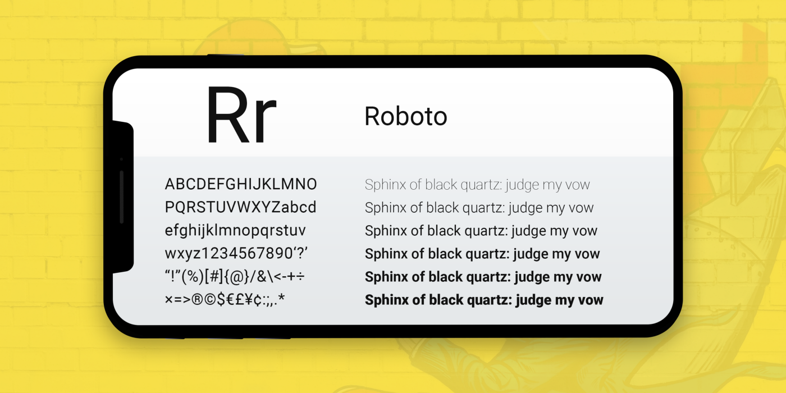
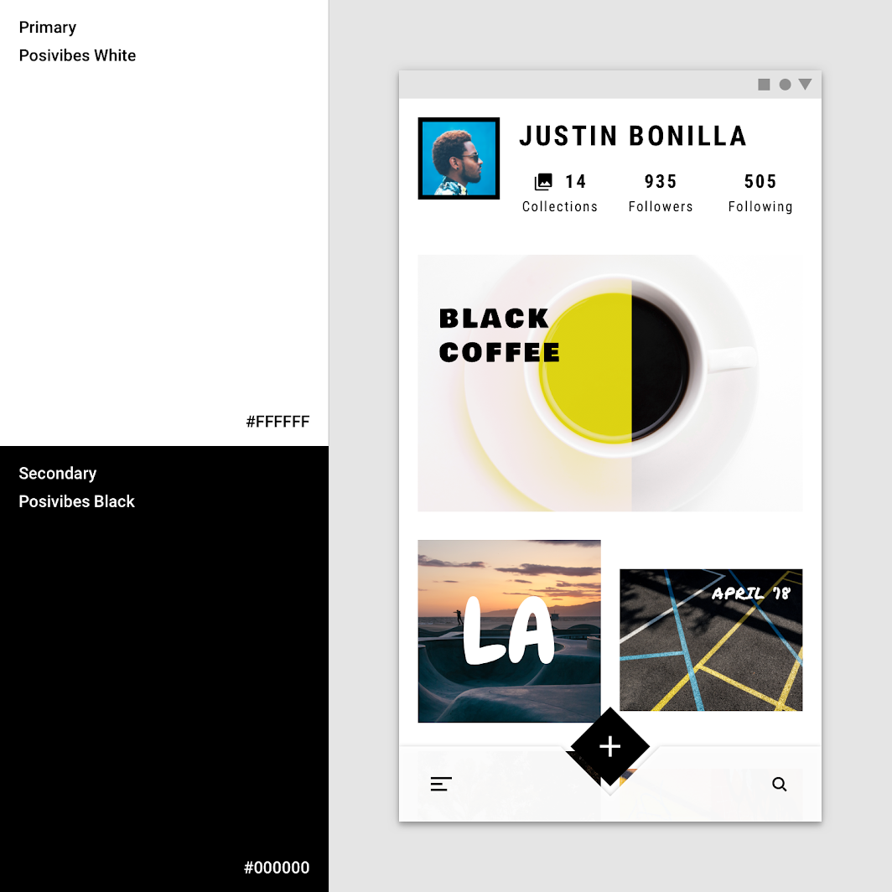

# DIU20
Prácticas Diseño Interfaces de Usuario 2019-20 (Economía Colaborativa) 

Grupo: DIU1_LEJIA.  Curso: 2019/20 

Proyecto: CraneTrip.

Descripción: Aplicación para compartir viaje.

Logotipo: 

Miembros
 * :bust_in_silhouette:   Luis Escobar Reche     :octocat:     
 * :bust_in_silhouette:  Jose Armando Albarado Mamani     :octocat:

----- 

En esta práctica estudiaremos un caso de plataforma de economía colaborativa y realizaremos una propuesta para su diseño Web/movil. Utilizaremos herramientas y entregables descritos en el siguiente CheckList (https://github.com/mgea/UX-DIU-Checklist) 

Qué es economia colaborativa: Martínez-Polo, J. (2019). **El fenómeno del consumo colaborativo: del intercambio de bienes y servicios a la economía de las plataformas**, *Sphera Publica, 1*(19), 24-46. http://sphera.ucam.edu/index.php/sphera-01/article/view/363/14141434

>>> Este documento es el esqueleto del report final de la práctica. Aparte de subir cada entrega a PRADO, se debe actualizar y dar formato de informe final a este documento online. 

# Proceso de Diseño 

## Paso 1. UX Desk Research & Analisis 

 1.a Competitive Analysis
-----
En el ámbito de la economía colaborativa existen muchas páginas que ofrecen este servicio, algunas
muy bien hechas y otras no tanto. Flip the Trip es un página web que nos permite compartir viajes y
obtener información sobre lugares, el motivo por el cual lo hemos elegido es por que carece de
muchas funcionalidades que consideramos que son cruciales para una aplicación de este tipo, como
por ejemplo estar disponibles para varias plataformas, en varios idiomas y que sobre todo tenga un
diseño intuitivo y sencillo, para que pueda atraer a clientes. Al igual que existen páginas que
carecen de funcionalidades importantes como Flip The Trip existen otras muchas que sí cumplen
con estos requisitos y como consecuencia son aplicaciones populares, como por ejemplo
coachsurfing.com, estas páginas tienen un buen diseño y ofrecen una buena experiencia a los
clientes, pero claro si deseamos estudiar las carencias de una aplicación de este tipo lo peor que
podemos hacer es elegir una aplicación cuyas carencias sean mínimas.

 1.b Persona
-----
Como personas ficticias hemos creado a María Martínez García y a José Fernández Cortés. Hemos
elegidos a estas dos personas para poder estudiar dos casos que pueden cubrir un amplio rango en la
sociedad. Por un lado el de una chica que es estudiante a la que le encantan las redes sociales y
dispone de pocos recursos económicos, esta representación de persona se puede reflejar en muchos
jóvenes de hoy en día y nos puede dar un amplio rango de estudio, sobre la mayoría de jóvenes.
Por el otro lado tenemos a una persona de mediana edad cuya prioridad es el trabajo, está pasando
por una separación de su pareja, decide por ello realizar una viaje para conocer a nuevas personas y
poder así despejar su mente y poder vivir una bonita expericienta. Hoy en día suelen pasar estas
situaciones, las personas se ven sobrecargadas ya sea por situaciones de trabajo o por situaciones
sentimentales, por ello decidimos crear a José para poder abarcar también un gran rango en la
sociedad.

-----

 1.c User Journey Map
----
Pensamos que estas experiencias para las dos personas serian las más habituales y consideramos que son las mas adecuadas para probar.

María es una amante de las redes sociales, por ello decide realizar una viaje a Manila (Filipinas)
como su situación económica es baja decide realizar el viaje en compañía. Sus amigos le
recomiendan la página Flip The Trip, ellos le cuentan las buenas experiencias que han tenido al usar
la página, a ella le cuesta adaptarse a la página ya que apenas domina el ingles, pero con ayuda de
amigos que si dominan el inglés consigue encontrar a un sevillano fotógrafo, con el que decide
realizar el viaje después de conocerlo.

José decide emprender un viaje a Nápoles por una temporada con el objetivo de despejar su mente,
cambiar de aires y conocer personas nuevas. Encuentra la página en internet y como domina el
inglés no le resulta difícil encontrar personas que viajen a Nápoles, en esa búsqueda encuentra a
Ann, una mujer residente en Nápoles, establece comunicación con ella a través de la página durante
un tiempo y decide ir allí para poder pasar tiempo con ella.

>>> Comenta brevemente porqué has escogido estas dos experiencias de usuario (y si consideras que son habituales) (80-150 caracteres) 

 1.d Usability Review
---- 
 - Enlace al documento: 
[Revisión de usabilidad](P1/Usability-review.pdf)
 - Valoración final:
45/100
 - Comentario sobre la valoración:  
Después de valorar cada apartado de la plantilla y tras comentar los peores apartados de la
aplicación, la puntuación final es de 45/100, lo cual hace un suspenso. La justificación de esta nota
es que en general esta aplicación es muy incompleta, ofrece pocas funciones, nada de ayuda online,
obliga al usuario a registrarse y no ofrece ninguna clase de medida de seguridad. En cuanto a
rendimiento y diseño visual no esta tan mal, ofrece las características mas básicas de las habituales
en una aplicación web pero en comparación con otras aplicaciones parecidas como Airbnb o
CoachSurfing, se queda obsoleta y muy poco confiable.

## Paso 2. UX Design  

 2.a Feedback Capture Grid
----
Nuestra propuesta de aplicación para compartir viaje se llama CraneTrip.
Consiste en una app para el móvil a corto plazo aunque se planea ampliar a otras plataformas a largo plazo.
Sus principales funciones y lo que la diferencia del resto es que hace la experiencia de las páginas para compartir viaje más fácil. Esto se consigue ya que consiste en un buscador como el de un buscador de vuelos u hoteles, en el que introduces unas fechas y un origen y destino. La búsqueda devuelve tres opciones; vuelos, hoteles o grupos de viaje. La parte de vuelos y hoteles es como cualquier comparador de vuelos, en el que reservas directamente tu vuelo comparándolo para buscar el que más te convenga. El añadido es los grupos, que actúan como grupos de cualquier red social, en el que alguien crea un grupo y los que buscan grupos de viaje solicitan acceso a él, tras tener acceso pueden ver los perfiles de los integrantes y elegir entrar definitivamente o no. Además hay un sistema de puntuación para dar valoraciones negativas o positivas a los compañeros de viaje. También se pueden marcar como favoritos vuelos hoteles o grupos para compararlos más tarde, además las tres cosas actúan como un paquete a la hora de reservar, de tal forma que en el apartado de reservas tengas tu viaje y te indique el vuelo hotel y grupo que has elegido.

 2.b Tasks & Sitemap 
-----
En el sitemap hemos añadido:
Index.html: Será la página principal.
Favoritos.html: Contendrá los viajes, alojamientos o grupos que desee guardar el usuario.
Reservas.html: Contendrá las reservas que tiene confirmado el usuario, tanto vuelos como alojamientos, cada uno de ellos contendrá toda la información asociada a la reserva.
Mensajes: En esta página el usuario podrá compartir mensajes con otro viajante o otro grupo de viajantes.
Perfil.html: En esta página se almacenará toda la información asociada al usuario.
About.html: En esta página se almacenará toda la información acerca de la empresa y que sea de interés para los usuarios.
Ayuda.html: En esta página se almacenará información como preguntas frecuentes, etc. Cualquier tipo de ayuda para el usuario, además se le proporcionará información para que pueda contactar con el equipo de ayuda.

Es esta tabla se ve que tareas se ejecutan con más frecuencia para distintos grupos de usuarios, en gris se marcan las tareas más importantes.
Consideramos estas tareas más importantes basándonos en que si estas funciones fallaran, la aplicación sería un fracaso, en cambio si fallan las otras seguiría siendo un gran fallo pero no un fallo crítico.
Se puede observar que las tareas de grupos, chat, redes sociales y el buscador las usan más los jóvenes y en cambio las tareas de reservar las usan más la gente mayor.

 2.c Labelling 
----
Hemos utilizado iconos que son muy utilizados hoy en dia en cualquier tipo de aplicación y creemos que no confundirán al usuario. En el caso de la página principal un ícono de una casa, en la sección favoritos un corazón, en la reservar un ícono de un libro, en los mensajes una viñera simulando un comentario, en el perfil un ícono de una persona, en about un icono de i, como de información y ya por ultimo de ayuda un icono de una interrogación.

[Labelling](P2/Labelling.pdf)

 2.d Wireframes
-----
Para el desarrollo de bocetos nos hemos centrado en dispositivos móviles, el boceto consta de varias partes:
Pantalla principal: En ella se detallan las búsquedas que desee realizar el usuario concretando el número de viajeros, la fecha, el origen y el destino. Además podrá ver los destinos populares, las fotos publicadas por los usuarios en sus redes sociales y las redes disponibles de la aplicación. Por último también dispondrá de un botón para acceder a los ajustes, y en la parte inferior un pequeño menú para acceder a las distintas secciones de nuestra aplicación.
Ajustes: En esta sección el usuario podrá configurar la aplicación, como activar/desactivar el modo oscuro, activar/desactivar las notificaciones, cerrar sesión, etc.
Búsquedas: Esta sección será la resultante de realizar una búsqueda en la pantalla principal, en ella se concretarán información de la búsqueda y además se mostrará todos los resultados obtenidos.
Favoritos: En esta sección el usuario almacenará todos los vuelos, alojamientos, grupos que desee guardar para poder ver en otro momento. Con esto se busca ofrecer una mejor experiencia al usuario para cuando desee guardar un viaje para el futuro. Así el usuario tenga acceso directo al viaje guardado en un futuro.
Mensajes: En esta sección de la aplicación el usuario podrá compartir mensajes con otros viajeros o con algún grupo de viaje.
Perfil: En esta sección el usuario podrá ver su información personal y la que está de forma visible a todos los demás usuarios. Además podrá subir algunas fotos, los demás usuarios podrá insertar comentarios en su perfil y este contestar a estos cuando desee. Además podrá introducir información de viajes que haya realizado. 
Reservas: En esta sección se encuentran todas las reservas del usuario, tanto de viajes como de alojamientos. En ella se almacenan todo tipo de información asociado al viaje o al alojamiento.

[Bocetos](Bocetos.pdf)

## Paso 3. Mi equipo UX-Case Study 

 3.a ¿Como se cuenta un UX-Case Study?
-----
### MuseMap
En general nos ha parecido una idea muy buena con un desarrollo muy bien llevado.

Primero hicieron una lluvia de ideas asumiendo que necesitan los usuarios e hicieron una lista.
Seguidamente decidieron hacer trabajo de campo y salieron a las calles de Londres a preguntar y fijarse en cómo interactúan los ciudadanos con el arte local. De esta forma sacaron más aspectos en claro como que la gente si quería buscar más información sobre una pieza de arte acudían a Google lo primero.
Una vez terminado el trabajo de campo hicieron una matriz de tareas comparando otras apps y resaltando funciones que no se han explorado mucho en estas para implementar en MuseMap.
Esto fue seguido de otra lluvia de ideas para hacer un mapa de empatía resaltando puntos críticos para los usuarios.
Después se hicieron una serie de entrevistas a usuarios para que dieran su opinión sobre la aplicación con lo que crearon un mapa de afinidad con la información recogida, de esta forma descubrieron que algunas cosas asumidas al principio eran falsas, y partieron de este mapa para el desarrollo.
También crearon dos personas ficticias con sus metas motivaciones, etc. y sacaron sus mapas de experiencia en distintas situaciones, de esta forma descubrieron, entre otras cosas,  que la gente no suele interesarse por el arte de la ciudad en la que vive al estar acostumbrado a él.
Ya en fase de desarrollo del prototipo hicieron varios bocetos de la aplicación con creciente calidad y decidieron centrarse en la parte del mapa y lo social.
Una vez terminado el prototipo se reunieron para pensar en el futuro de la aplicación y mejoras que podrían implementarse.

Personalmente creemos que las propuestas de hacer un trabajo de campo, comparar otras apps y las entrevistas a la gente fueron los métodos más interesantes de diseño.

En cuanto a otro método que hubiésemos usado pensamos que llamar a un experto y que haga un análisis de la aplicación dando su opinión es muy buena idea.

  3.b Logotipo
----

Hemos usado para diseñarlo la herramienta [TailorBrands](https://www.tailorbrands.com/es/logo-maker). Esta herramienta es gratis pero se necesita la version pro para guardar los logos en varias resoluciones.

 3.c Guidelines
----

Como tipografía principal de la aplicación hemos decidido optar por una tipografía moderna, sencilla y que sea perfectamente legible: Roboto. Roboto es una fuente de uso libre de Google Fonts. Esta tipografía la podemos combinar con otra tipografía como por ejemplo Open Sans, la cual es también muy utilizada, de uso libre y desarrollada por Google Fonts. Por tanto como tipografía principal empleamos Roboto y como tipografía secundaria Open Sans. Respecto al tamaño de fuente hemos decidido seguir los estándares, para Roboto se recomienda usar un tamaño de 14-18px para el contenido principal mientras que para las cabeceras un tamaño de 28-34px. Respecto a Open Sans también seguimos los estándares, es decir, utilizar un tamaño de 12-16px para contenidos principales y un tamaño de 24-30px para cabeceras.
A continuación adjunto un par de imágenes de cada tipo de fuente:

Roboto:

Open Sans:

-Fuente de las imágenes: https://medium.muz.li/top-5-ui-fonts-for-website-mobile-apps-d78829e58f7e

Respecto a los colores que vamos a utilizar en nuestra página hemos optado por unos colores básicos para no generar confusión a los usuarios cuando usan nuestra aplicación y no se encuentren colores llamativos o incluso colores que molesten a la vista, un ejemplo perfecto de colores que queremos emplear:

Color de letra: Negro
Color de Títulos: Negro
Color de cabeceras y Barra de navegación inferior: Negra
Títulos en las cabeceras o en las barras de navegación: Blanca

Nuestro objetivo es jugar con el blanco y el negro, proporcionando así una aplicación que emplea colores básicos y que pretende dar gran importancia a su contenido. Por tanto, el objetivo principal y por el cual usamos estos colores básicos es conseguir que el usuario se vea más impresionado por el contenido de nuestra aplicación como imágenes de lugares a los que viajar, imágenes compartidas por usuarios, etc. Un ejemplo para ilustrar el camino por el que queremos orientar nuestra aplicación:

-Fuente de la imagen: 
https://material.io/design/color/applying-color-to-ui.html#typography-and-iconography 

Respecto a los patrones:

En primer lugar, como patrón de organización de la información hemos decido implementar el patrón combinado: Destacado/Buscar/Navegar porque combina varios estilos para organizar la información y nos viene perfecto porque además de mostrar información al usuario queremos añadir buscadores para mejorar la experiencia del usuario. Además, cuando un usuario se encuentre navegando puede realizar una búsqueda de forma sencilla sin tener que cambiar de localización dentro de la app.

Cuando se realice un usuario quiera realizar una búsqueda vamos a introducir técnicas de autocompletado y cuando se obtengan los resultados también introduciremos la opción de filtrar los resultados.

En relación a la organización de las imágenes queremos organizar las imágenes en forma de carrusel, creemos que es la forma más utilizada en la actualidad y al usuario le resultará familiar, sabrá utilizar el carrusel. No buscamos proporcionar dificultades ni problemas al usuario durante el uso de nuestra app, luego el uso de estilos/iconos/herramientas ya implementadas por muchas aplicaciones hoy en día nos ayuda a conseguir este objetivo pues el usuario ya está familiarizado a ello. Por último, aclarar que cada una de las imágenes tendrán disponibles las opciones de ampliar la imagen, volver a la anterior imagen, e ir a la siguiente imagen. 

Para el patrón de navegación hemos de decidido implementar la navegación con tabuladores en la parte inferior de nuestra App. La navegación con tabuladores en las aplicaciones móviles ha ido adquiriendo gran importancia y es bastante utilizada pues proporciona una navegación fluida entre las diferentes secciones de nuestra App. Además, es bastante intuitiva pues cuenta con iconos y una pequeña descripción que ayudan al usuario a entender cada una de las secciones disponibles, adjunto un pequeño ejemplo de navegación con tabuladores en Apps:

Fuente de la imagen: 
https://dribbble.com/shots/7057842-Tab-bar-menu-navigation

  3.d Video
----
[video](P3/video.mp4)

## Paso 4. UX Check (Usability Testing) 

 4.a A/B Testing
----

### Caso 1

Hemos evaluado al equipo [DIU1.MGM](https://github.com/Manu8G/DIU20), que hizo una valoración de la aplicacion web Nomadizers.

[Hoja de valoración](P4/UXCaseStudy-review_DIU1_MGM.xls)

### Caso 2

Hemos evaluado a el equipo [DIU2.Mjolnir](https://github.com/Nintwarr/DIU20), que ha hecho un análisis a la página web [Compartetupiso.com](compartetupiso.com), en general está bastante completa y bien estructurada.

[Hoja de valoración](P4/UXCaseStudy-review_DIU2_Mjolnir.xls)

### Caso 3

Hemos evaluado al equipo [DIU3.Learning](https://github.com/salva12345678/DIU), que hizo una valoración de una aplicación para aprender idiomas.

 4.b User Testing
----

Hemos elegido a [María Martínez García](P1/Persona1.png)

	Situación de DIU1.MGM experiencia de Jesus Garrido:
	Maria en esta situación tambien se iria de viaje, pero se encontraria con el problema de que al entrar en la pagina de Nomadizers hay que registrarse para ver algo. La experiencia de Maria seria parecida a la que sigue en nuestra aplicación, pediria ayuda a un amigo para controlar la pagina y probablemente habria acabado igual.

	Situación de DIU2.Mjölnir experiencia de Javier Roldán:
	María es una persona irresponsable e indecisa, luego encontrar un piso para compartir le costaría bastante. Pero como es una persona simpática seguro encontrará algun compañero que al descubrir como es la personalidad de maría, no le importe compartir piso con ella. Otro problema que encuentra maría es que no domina otro idioma que no sea el español, luego compartir piso con una persona que hable español también se resultará un gran problema.

	Situación de DIU3.Learning experiencia de Manuel Molina Muñoz:
	Maria en esta situación habria intentado mejorar su inglés, ya que tenia bajo nivel. Al encontrar la pagina veria que esta en español, y podria haberse apuntado sin problemas. Al ser grupos presenciales con gente Maria habria estado agusto y su experiencia acabaria siendo muy satisfactoria.

. 4.c Ranking
----

1º) DIU3.Learning 79pts
2º) DIU2.Mjolnir 74pts
3º) DIU1.MGM 71pts

## Conclusión / Valoración de las prácticas

En general al realizar un estudio acerca de los tres proyectos propuestos por el profesor, hemos llegado a la conclusión de que crear personas ficticias coherentes y que representen a una persona cualquiera hoy en dia es importante, ya al fin y al cabo las personas normales y comunes son las que llegarán a utilizar nuestra aplicación, luego crear una persona ficticia poco coherente no tendría ninguna aportación positiva en el desarrollo de nuestro proyecto. 
Por otro lado, también hemos llegado a la conclusión de que crear buenos bocetos es esencial para que otra persona pueda comprender nuestro proyecto y además nos ayuda a encontrar posibles errores o elementos ambiguos que afectarán de mala manera a nuestra aplicación. Además, si se realizan de forma clara y correcta ayudarán a ver si nuestro proyecto avanza en buen camino. 
Por último, también creemos que desarrolar un buen user journey map es de gran importancia pues nos ayudará a estudiar posibles acciones y dificultades que encuentra un usuario a la hora de buscar nuestra aplicación o a la hora de usar nuestra aplicación. Un ejemplo perfecto es el caso de museMapp en el que gracias al user journey map se consiguió obtener información importante acerca del comportamiento de las personas, sobre cual sería la mejor forma de acercar la aplicación a ellos y que les sea muy facil de utilizar.

